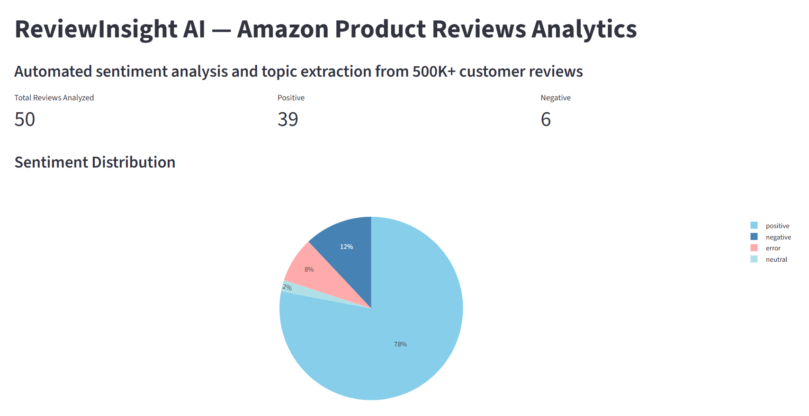
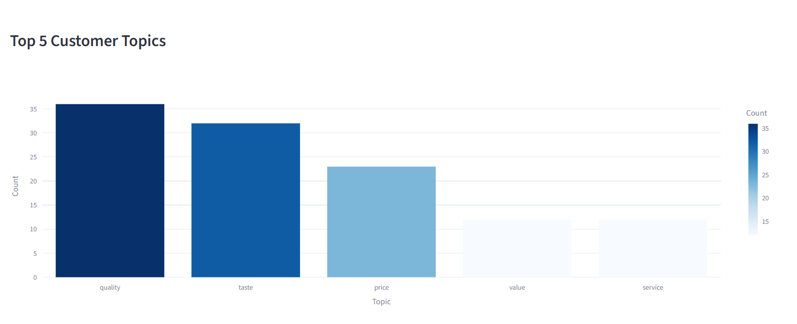
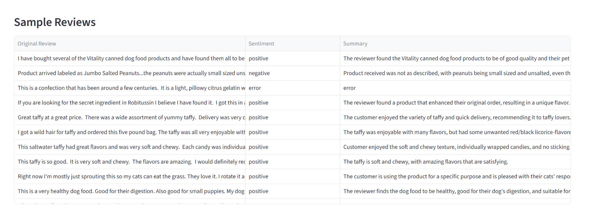

# ReviewInsight AI — Amazon Product Reviews Analytics

[](https://github.com/mivlabs/review-insight-ai/actions/workflows/ci.yml)

Automated sentiment analysis and topic extraction from 500K+ customer reviews using LLM.





## 🎯 Business Value

This tool helps businesses:
- **Save 20+ hours/week** of manual review analysis
- **Identify key customer pain points** automatically
- **Track sentiment trends** over time
- **Make data-driven decisions** based on real customer feedback

## 🏗 Architecture

```
CSV (568K reviews) → pandas → OpenRouter API (Llama-3) → SQLite → Streamlit Dashboard
```

**Key decisions:**
- **OpenRouter API** — cost-effective, multiple models, no credit card required
- **SQLite** — zero-config for demo, easily migratable to PostgreSQL
- **Streamlit** — rapid dashboard development without frontend expertise
- **Llama-3 8B** — fast, accurate, supports structured JSON output
- **Docker** — containerized deployment, one-command setup

## 🚀 Quick Start

### Option 1: Local Installation

#### 1. Clone the repository
```bash
git clone https://github.com/mivlabs/review-insight-ai.git
cd review-insight-ai
```

#### 2. Install dependencies
```bash
python -m venv venv
source venv/bin/activate  # On Windows: venv\Scripts\activate
pip install -r requirements.txt
```

#### 3. Set up OpenRouter API key
Get your free API key at https://openrouter.ai

Create `.env` file:
```
OPENROUTER_API_KEY=your_key_here
```

#### 4. Run ingestion pipeline
```bash
python ingest.py
```

This will analyze the first 50 reviews from `data/reviews.csv` and save results to `data/reviews.db`.

#### 5. Launch dashboard
```bash
streamlit run dashboard.py
```

Open http://localhost:8501 in your browser.

### Option 2: Docker (Recommended)

#### Prerequisites
- [Docker Desktop](https://www.docker.com/products/docker-desktop/) installed and running

#### 1. Clone the repository
```bash
git clone https://github.com/mivlabs/review-insight-ai.git
cd review-insight-ai
```

#### 2. Set up OpenRouter API key
Create `.env` file:
```
OPENROUTER_API_KEY=your_key_here
```

#### 3. Run ingestion pipeline (local)
```bash
python ingest.py
```

#### 4. Build Docker image
```bash
docker build -t review-insight-ai .
```

#### 5. Run with Docker
```bash
docker run -p 8501:8501 --env-file .env -v $(pwd)/data:/app/data review-insight-ai
```

**On Windows PowerShell:**
```powershell
docker run -p 8501:8501 --env-file .env -v ${PWD}/data:/app/data review-insight-ai
```

#### 6. Or use docker-compose (simplest)
```bash
docker-compose up
```

Open http://localhost:8501 in your browser.

**To stop:** Press `Ctrl+C` or run `docker-compose down`

## 📊 Dataset

This project uses the [Amazon Fine Food Reviews](https://www.kaggle.com/datasets/snap/amazon-fine-food-reviews) dataset from Kaggle:
- 568,454 reviews
- October 1999 - October 2012
- Real customer feedback with ratings

**To run this project:**
1. Download the dataset from Kaggle (link above)
2. Place `reviews.csv` in the `data/` folder
3. Run `python ingest.py`

Note: The dataset is not included in this repository due to its size (286 MB).

## 🛠 Tech Stack

- **Python 3.11**
- **OpenAI SDK** — LLM API client
- **OpenRouter API** — LLM provider (Llama-3 8B)
- **SQLite** — lightweight database
- **Streamlit** — dashboard framework
- **Plotly** — interactive visualizations
- **pandas** — data processing
- **Docker** — containerization

## 📈 Future Improvements

- [ ] Migrate to PostgreSQL for production
- [ ] Add batch processing for all 568K reviews
- [ ] Implement real-time monitoring
- [ ] Add export to CSV/PDF
- [ ] Add CI/CD pipeline (GitHub Actions)

## 🔧 Development Workflow

### Making changes

1. **Edit code** in your local repository
2. **Test locally:**
   ```bash
   python ingest.py  # Re-run ingestion if needed
   streamlit run dashboard.py  # Check dashboard
   ```

3. **Commit changes:**
   ```bash
   git add .
   git commit -m "Description of changes"
   git push
   ```

4. **Rebuild Docker image** (if dependencies changed):
   ```bash
   docker build -t review-insight-ai .
   ```

### Common issues

**Issue:** `no such table: reviews_analysis` in Docker
**Solution:** Mount the data volume:
```bash
docker run -p 8501:8501 --env-file .env -v $(pwd)/data:/app/data review-insight-ai
```

**Issue:** Large files (CSV/DB) won't push to GitHub
**Solution:** They're already in `.gitignore`. If accidentally added:
```bash
git rm --cached data/reviews.csv
git commit --amend -m "Your commit message"
git push --force
```

## 📄 License

MIT License